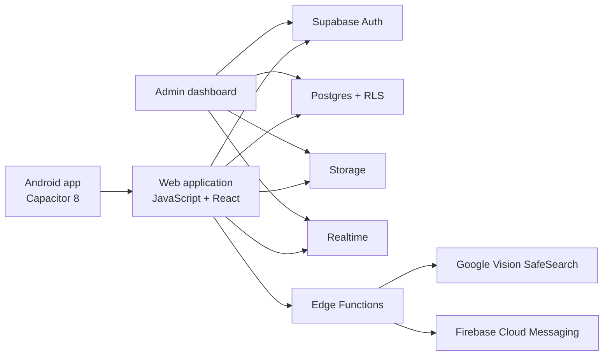

# AFTER

> From idea to a production Android application with Codex.

AFTER is a Brazilian relationship app for gay men focused on proximity, discretion, safety, and direct conversation. It was created by an independent builder without a traditional software-engineering background through an iterative collaboration with Codex.

This repository accompanies the AFTER submission to the **OpenAI Build Week 2026**, in the **Apps for Your Life** category.

## Why this project exists

Many relationship apps make core connection features expensive or interrupt the experience with aggressive advertising. AFTER explores a different approach: keep discovery, profiles, conversations, safety tools, and meaningful interaction useful and accessible, then build sustainable optional value around them.

The project also demonstrates a second idea: AI can expand who is able to build production software. Codex did not define the product or replace human judgment. It acted as an engineering partner that explained, investigated, implemented, tested, and refined the system alongside its creator.

## Working product

The application currently provides:

- Nearby discovery with Lounge and Compacto views.
- Real-time chat with text, images, voice messages, and location cards.
- Profiles, galleries, favorites, connections, blocking, and reporting.
- Presence and recent-activity signals.
- Native Android photo selection, crop, compression, and upload.
- Human and Google Vision assisted profile-photo moderation.
- Android push notifications and native device integrations.
- Age safeguards, screenshot protection, and account controls.
- A separate administrative dashboard for users, moderation, support, and system health.

## Architecture



## Technology

- JavaScript, HTML, CSS, and React 19
- Capacitor 8 with native Android extensions
- Supabase Auth, Postgres, Storage, Realtime, RLS, and Edge Functions
- Firebase Cloud Messaging
- Google Cloud Vision SafeSearch
- Vercel
- `react-easy-crop`

## Local web setup

### Requirements

- Node.js 24 or newer
- npm 11 or newer

### Install and build

```bash
npm install
npm run build
```

Serve the generated `dist/` directory with any static server:

```bash
npx serve dist
```

The sanitized judging repository uses placeholder backend configuration. A reviewer can inspect and build the complete client without receiving access to production user data or production credentials.

## Android setup

### Additional requirements

- JDK 17
- Android Studio
- Android SDK 35+

```bash
npm install
npm run cap:sync
cd android
./gradlew assembleDebug
```

On Windows, use `gradlew.bat assembleDebug`.

Production signing files, service-account credentials, and environment secrets are intentionally excluded.

## Important code paths

- `src/app.js`: application orchestration, navigation, native lifecycle, and interaction flows.
- `src/views/`: discovery, chat, profile, authentication, connections, admin, and public pages.
- `src/services/`: authentication, profiles, chat, notifications, moderation, support, and backend access.
- `src/lib/photo/`: shared photo selection, crop, compression, and conversion pipeline.
- `android/`: Capacitor Android project and native integrations.
- `supabase/migrations/`: schema evolution, policies, moderation, chat, presence, and admin operations.
- `supabase/functions/`: server-side moderation, push, and support flows.

## How Codex and GPT-5.6 were used

AFTER was built through a continuous Codex workflow rather than a single generated prototype. The creator brought product decisions, real-device tests, screenshots, user reports, and acceptance criteria. Codex inspected the codebase, explained unfamiliar concepts, proposed scoped approaches, implemented changes, ran builds, diagnosed regressions, and prepared release artifacts.

During Build Week, GPT-5.6 and Codex were used to:

- Audit the production implementation and validate technical claims.
- Identify security risks before preparing the judging repository.
- Reconstruct the development narrative from the actual code and release history.
- Create this README, submission, architecture explanation, and video plan.
- Curate evidence around the hardest engineering work.

Representative engineering episodes include the Capacitor 8 migration, Android photo URI handling, chat state/realtime reconciliation, native audio recording, push notifications, secure-screen support, Supabase RLS, and photo moderation.

**Codex Session ID:** `019ee61b-1ba3-78c3-b219-f16947cad37d`

## Privacy and security

- No private service-account credential belongs in the client.
- Profile moderation secrets run in backend Edge Functions.
- Administrative authorization is separate from public profile identity.
- Row Level Security limits access to user and moderation data.
- The judging repository contains no keystore, signing password, database password, service-account key, or production `.env` file.

## Current limitations

- The public community is in its early growth stage.
- Some operational services require the hosted backend and cannot be reproduced from a local static build alone.
- Automated moderation is intentionally conservative and can route uncertain cases to humans.

## Build Week

- **Category:** Apps for Your Life
- **Demo:** https://www.youtube.com/watch?v=NqfTXpNx1cM
- **Source:** https://github.com/mersonsilva/after-build-week
- **Live web product:** https://after-github-fix.vercel.app
- **Google Play:** https://play.google.com/store/apps/details?id=br.com.afterapp.app
- **Submission deadline:** July 21, 2026 at 5:00 PM PT

## Creator

Created in Brazil by **Emerson Nicolas**, with Codex as an AI engineering partner.

## License

Copyright (c) 2026 Emerson Nicolas. Review access is granted for OpenAI Build Week judging. See `LICENSE` in the judging repository.
